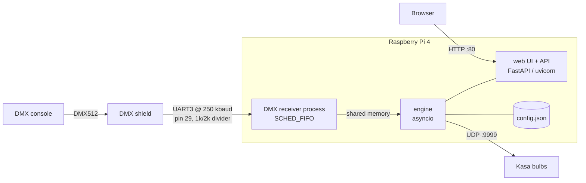
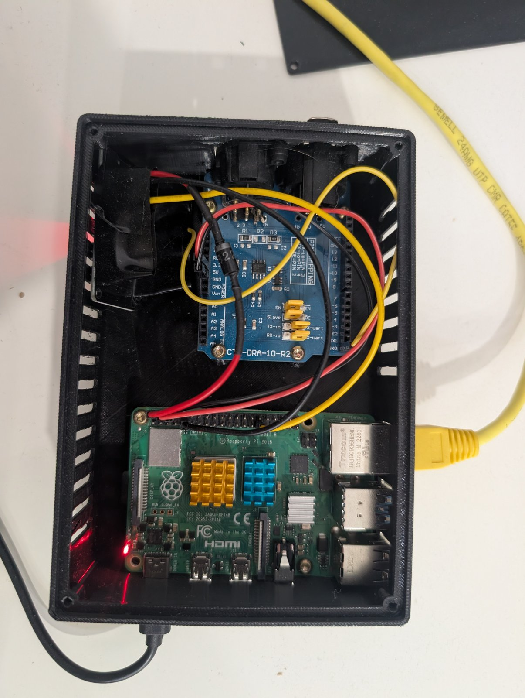
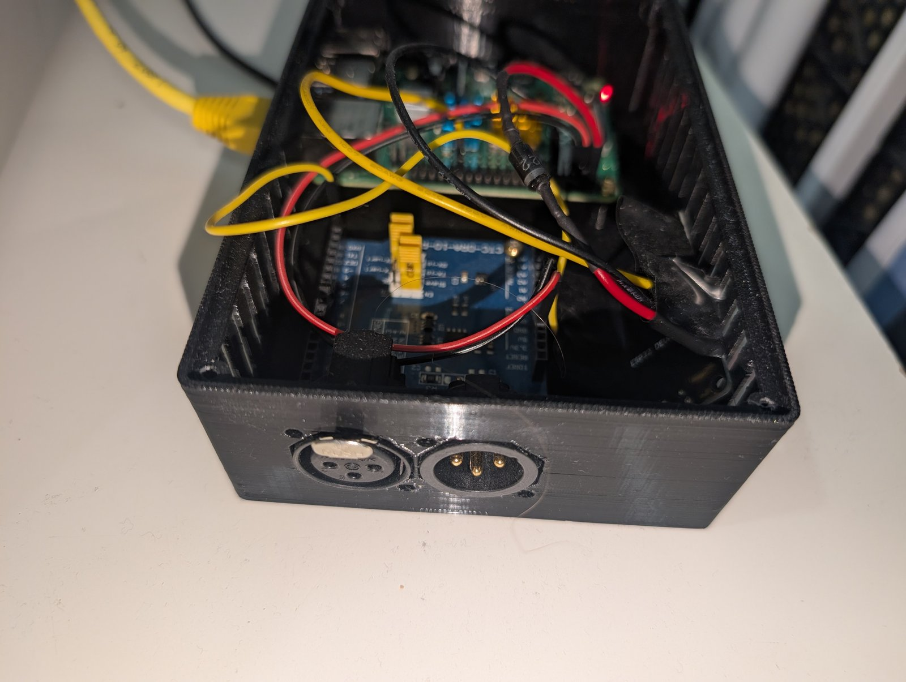
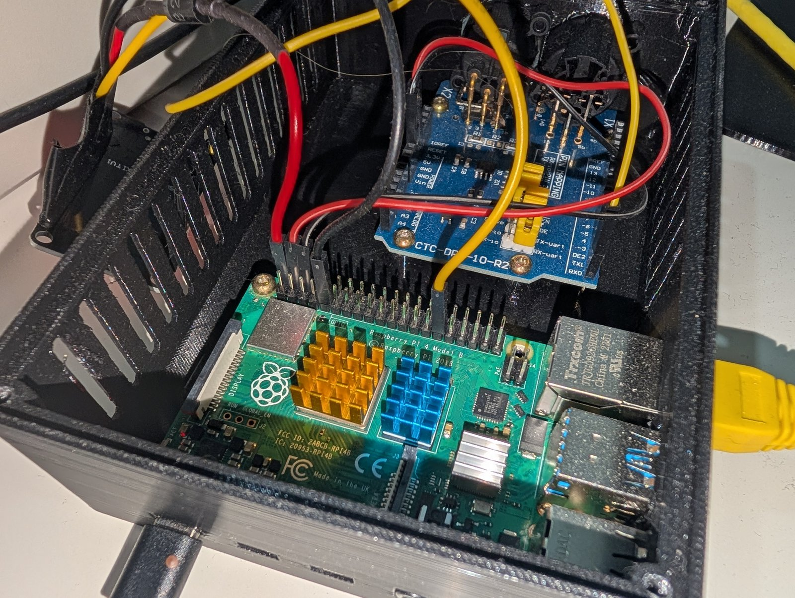
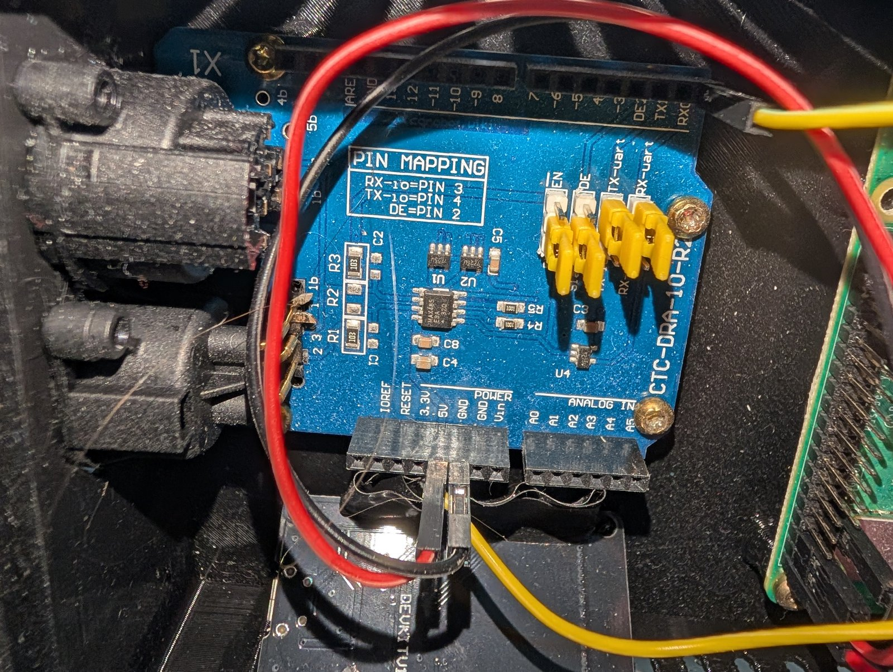
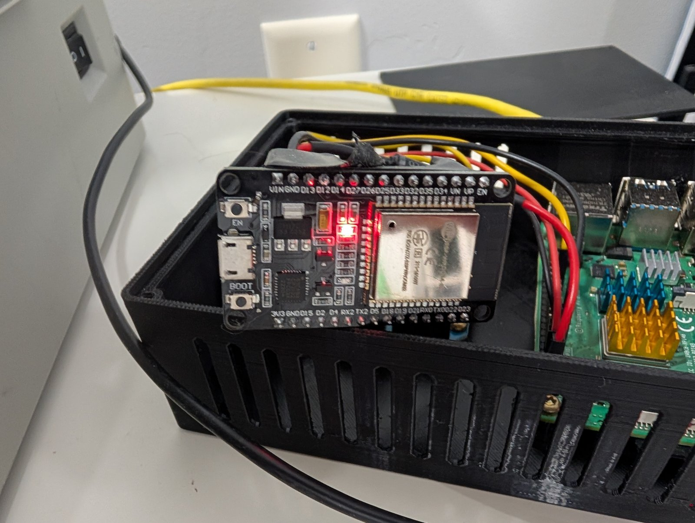
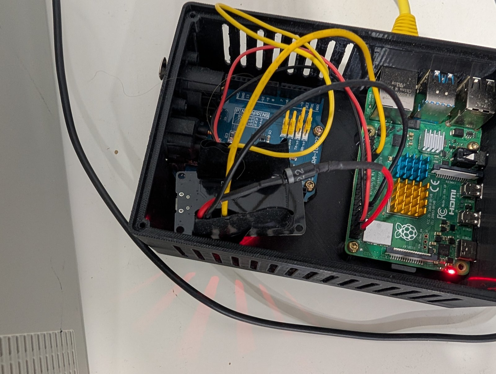
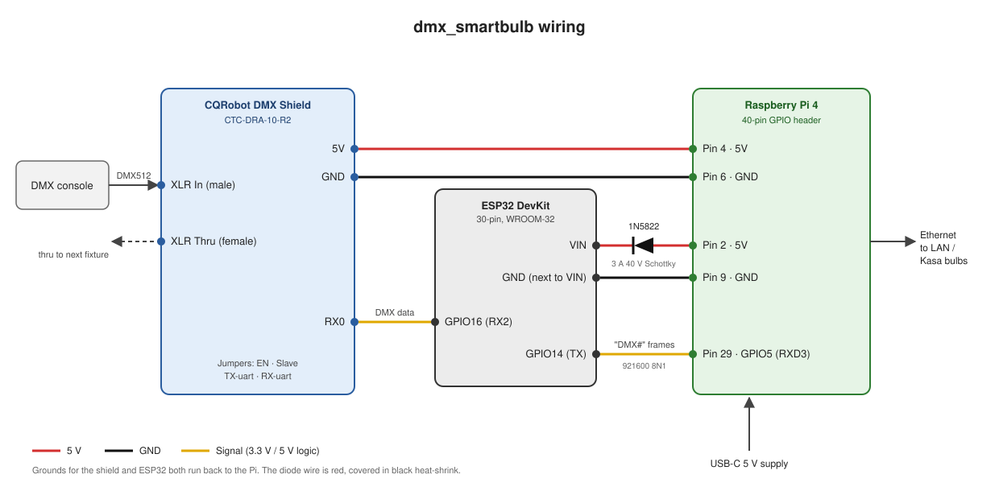

# dmx_smartbulb

Control TP-Link Kasa smart bulbs from a DMX lighting console.

A Raspberry Pi 4 reads a DMX universe directly on one of its UARTs, maps each bulb's
DMX channels to hue / saturation / intensity (plus color temperature in HSIC mode),
and sends the colors to the bulbs over the local network using the Kasa UDP protocol.
A web UI on the Pi is used to find bulbs, patch them, arrange them on a stage map,
save looks and test colors.

## How it works



Everything runs from one systemd service, `dmx_smartbulb.service`, which starts
`python -m engine run`. That one Python process holds:

- **The engine** ([engine/core.py](engine/core.py), [engine/sender.py](engine/sender.py)):
  an asyncio loop that turns DMX frames, manual colors and looks into bulb commands.
- **The web UI** ([engine/web.py](engine/web.py), [web/static/](web/static/)): FastAPI
  served by uvicorn on port 80 in the same event loop. A WebSocket (`/api/live`) pushes
  status to the browser about ten times a second.

The DMX receiver ([engine/receiver.py](engine/receiver.py)) is a separate child process
running at real-time priority (`SCHED_FIFO`). It reads `/dev/ttyAMA3`, parses DMX
packets ([engine/dmx_uart.py](engine/dmx_uart.py)) and publishes the latest 512
channels to shared memory, so busy network sends or web requests can never make it
drop bytes. The engine restarts it if it dies. A packet whose length suddenly changes
is held back until the new length repeats, so a flaky cable can't flash the bulbs.

### Sending to the bulbs

- **Sync mode** (the default): the sender works in output frames. Each frame sends to
  every bulb whose color changed, all at once, so bulbs move together instead of
  trickling. The frame period is the per-bulb interval, stretched if needed so the
  whole rig stays inside the bandwidth budget.
- **Max WiFi Bandwidth** (default 500 commands/sec) caps the packets per second for the
  whole rig. **Max Per-Bulb Update Rate** (default 10 commands/sec) caps each bulb.
- Every command tells the bulb to fade over a fixed **30 ms**.
- KL bulbs reply to every command. Replies mark a bulb online and measure its round-trip
  time (RTT). A command with no reply within 0.5 s is a miss. After **3 misses in a row**
  the bulb is shown as **slowed**: its updates are spaced out (up to once a second) until
  it answers again.
- Commands that weren't confirmed are re-sent after 2 s. Bulbs that haven't been heard
  from for 3 s get a status check; a bulb with no reply for 5 s is shown offline.
- Bulbs are identified by **MAC address**. If a bulb has been offline for 10 s, the engine
  rediscovers bulbs and updates the IP of any that moved, then saves the config.

### Kasa protocol

[engine/kasa.py](engine/kasa.py) talks to the bulbs directly using the Kasa *legacy*
local protocol: JSON obfuscated with an XOR "autokey" cipher (initial key 171), as UDP
packets to port 9999. One non-blocking socket is shared by every bulb. Discovery
broadcasts `get_sysinfo` to `255.255.255.255`.

### Channel mapping

A bulb patched at channel **N** reads:

| DMX channel | Meaning | Scaling sent to bulb |
|-------------|---------|----------------------|
| N     | Hue | 0–255 → 0–360° |
| N + 1 | Saturation | 0–255 → 0–100 % |
| N + 2 | Intensity | 0–2 = off (dead zone); 3–255 through the brightness curve (default square law) |
| N + 3 | Color temperature (**HSIC only**) | 0 = 2500 K … 255 = 6500 K |

- **HSI** mode uses 3 channels; **HSIC** mode uses 4. At saturation 0, an HSIC bulb
  switches to its real white LEDs at the color temperature on N + 3, instead of mixing
  white from color.
- Bulbs with the same start channel and the same size share one address on purpose
  and change together. Partly overlapping addresses get a warning in the UI.
- A bulb can also **follow a group's shared channel** instead of having its own.

## ESP32 DMX receiver (optional, legacy)

The Pi now reads DMX itself, so the ESP32 is no longer needed. The `esp32` input is
kept for one more release in case the direct input causes trouble at the venue.

Firmware source: [dmx_esp32/](dmx_esp32/) (PlatformIO, Arduino framework, `esp32dev` board,
using the [esp_dmx](https://github.com/someweisguy/esp_dmx) library).

- `loop()` receives DMX512 on UART2 through the shield's RS-485 transceiver and copies
  each good packet into a buffer guarded by a mutex.
- A `SerialTx` task pinned to core 0 sends that buffer to the Pi every 20 ms (~50 Hz)
  as ASCII `DMX#` plus the 512 channel bytes (byte 4 is DMX channel 1; the start code
  isn't sent), at 921600 baud 8N1, into the Pi's UART3.
- If DMX is lost, the ESP32 keeps sending the last good frame, so bulbs hold their
  color. The engine's **When DMX stops** setting never triggers in this mode.

To use it, wire it as in [Legacy ESP32 wiring](#legacy-esp32-wiring), then on the Setup
tab download a backup, change `"input"` to `{"backend": "esp32", "port": "/dev/ttyAMA3"}`,
and restore that file. The receiver restarts with the new input.

Debug output goes to the ESP32's USB serial port at 115200 baud. Build and flash from
`dmx_esp32/` with `pio run -t upload`, or with
[tools/esp32_flash.sh](tools/esp32_flash.sh) (backs up the board's flash first).

## Hardware

### Parts

| Part | Notes |
|------|-------|
| Raspberry Pi 4 Model B, 1 GB | Stick-on heatsinks; wired Ethernet; powered from its USB-C port. Only the Pi 4 is supported (UART3 on GPIO4/5 doesn't exist on a Pi 3, and a Pi 5's UARTs differ) |
| CQRobot DMX (RDM) Shield for Arduino ([Amazon B01DUHZAT0](https://www.amazon.com/dp/B01DUHZAT0)) | Silkscreen `CTC-DRA-10-R2`. MAX485 RS-485 transceiver plus two 3-pin XLR jacks (DMX in/thru). Used standalone, without an Arduino |
| 1 kΩ and 2 kΩ resistors | Divider between the shield's RX0 (5 V logic) and the Pi's pin 29 (3.3 V) |
| TP-Link Kasa **KL135** smart bulbs | The only model tested; see [Supported bulbs](#supported-bulbs) |
| 3D-printed vented enclosure | |
| Jumper wires | Dupont connectors on the Pi header and the shield |
| *Optional:* Enttec Open DMX USB | Plugged into the Pi, it enables the **Control Board** tab (test DMX without a console) |
| *Legacy:* ESP32 DOIT DevKit V1 (30-pin, ESP32-WROOM-32) and a 3 A 40 V Schottky diode (1N5822) | Only for the old [ESP32 input](#esp32-dmx-receiver-optional-legacy) |

### Photos

The photos show the earlier build, with the ESP32 between the shield and the Pi.













### DMX shield jumpers

| Jumper | Setting | Effect |
|--------|---------|--------|
| EN / EN̅ | **EN** | Shield enabled |
| Slave / DE | **Slave** | Transceiver held in receive mode; the DE pin is not used |
| TX-io / TX-uart | **TX-uart** | Transmit data on header pin 1 (TX1); not wired |
| RX-io / RX-uart | **RX-uart** | Received DMX data on header pin 0 (**RX0**) |

The silkscreen's "PIN MAPPING" box (RX-io = 3, TX-io = 4, DE = 2) only applies when
the jumpers are in the io/DE positions, which this build doesn't use.

### Wiring

| From | To | Purpose |
|------|----|---------|
| XLR **In** (male) | DMX console | DMX512 in |
| XLR **Thru** (female) | Next fixture (optional) | DMX pass-through |
| Shield **RX0** | 1 kΩ in series → Pi **pin 29** (GPIO5 / RXD3) | DMX data, 250 kbaud |
| Pi **pin 29** | 2 kΩ → Pi GND | Bottom of the divider |
| Pi **pin 4** (5 V) | Shield **5V** | Shield power |
| Pi **pin 6** (GND) | Shield **GND** (the one next to 5V) | Shield ground |

> **Logic levels:** the shield's MAX485 runs from 5 V, so RX0 swings close to 5 V. The
> 1 kΩ / 2 kΩ divider brings that down to about 3.3 V for the Pi, whose GPIO pins are
> not 5 V tolerant. Don't leave it out.

> **Use pin 29, not pin 10.** UART0 on pin 10 (GPIO15) corrupted bits in testing
> (0 read as 1) while that pin's pull-up was on. The same wire on pin 29 is clean.

#### Legacy ESP32 wiring



| From | To | Purpose |
|------|----|---------|
| Shield **RX0** | ESP32 **GPIO16** (RX2) | DMX data |
| ESP32 **GPIO14** | Pi **pin 29** (GPIO5 / RXD3) | Framed DMX at 921600 baud |
| Pi **pin 2** (5 V) | ESP32 **VIN** through the 1N5822 (anode at the Pi) | ESP32 power |
| Pi **pin 9** (GND) | ESP32 **GND** (the one next to VIN) | ESP32 ground |

The diode wire is red but covered in black heat-shrink. ESP32 GPIO17 (TX2) and GPIO21
(RTS) are set up by the firmware but not connected, because the Slave jumper
hard-wires the shield to receive. In this build RX0 drives ESP32 GPIO16 at close to 5 V,
above the ESP32's rated 3.6 V; put the same divider on that line if you use it.

### Power

The Pi is powered from its USB-C port, and the shield runs off the Pi's 5 V header
pins. In the legacy build, the ESP32 is fed from VIN through the Schottky diode, which
drops about 0.3–0.5 V and stops the ESP32's USB port from back-feeding the Pi's 5 V rail
while it's plugged into a computer for flashing.

### Network

```
Pi 4 ──Ethernet──▶ WiFi router LAN port
                   WiFi router ◀──WiFi── Kasa bulbs
```

The Pi is wired into a LAN port on the WiFi router, and the bulbs join that router's
WiFi network. The Pi's own WiFi radio is off unless setup is run with `--wifi on`
(only needed for pairing bulbs, which is [planned](#future-enhancements)). The router
has to bridge its LAN ports and WiFi into one subnet (the default on home routers),
because:

- **Discovery** broadcasts to `255.255.255.255`, which only reaches devices in the
  same broadcast domain.
- **Color commands** go directly to each bulb's IP.

Don't put the bulbs on a guest network, and turn off "AP/client isolation" on the
bulbs' network. Either one blocks the Pi from reaching them.

**Give every bulb, and the Pi, a DHCP reservation on the router.** Bulbs are stored by
MAC, and the engine finds a bulb again if its IP changes, but only after the bulb has
been offline for 10 s or more. Reservations avoid that during a show.

## Installing on a Raspberry Pi

1. **Flash the OS.** Use Raspberry Pi Imager to write **Raspberry Pi OS Lite (64-bit)**,
   Debian 12 "bookworm", for a **Pi 4**. In the Imager settings, set the hostname,
   create a user, and enable SSH.

2. **Network.** Connect Ethernet to a LAN port on the router whose WiFi the bulbs use.
   Reserve IPs for the Pi and the bulbs; see [Network](#network).

3. **Get the code and run setup.**

   ```bash
   sudo apt update && sudo apt install -y git
   sudo git clone https://github.com/yesterdayforgotten/dmx_smartbulb.git /dmx_smartbulb
   cd /dmx_smartbulb
   sudo ./setup.sh
   ```

   `setup.sh` installs `python3-venv` and `avahi-daemon`, creates `.venv`, installs
   [requirements.txt](requirements.txt), and then hands over to `python -m engine setup`
   ([engine/setup.py](engine/setup.py)). That prints a plan of what it will change and
   asks before doing anything. It's safe to re-run: every step checks the current state
   first, and steps that are already done show `✓ ok`.

4. **Reboot when it says so** (`sudo reboot`), then check:

   ```bash
   sudo ./setup.sh --check
   ```

   This changes nothing. It reports any steps still pending, then a health check:
   `/dev/ttyAMA3` exists, the service is active, the web UI answers, DMX is arriving,
   bulbs are online, and the SD card had no writes for 60 s.

5. **Open the web UI** at `http://<hostname>.local/` (or the Pi's IP). On the first
   visit it asks you to choose the password venue staff will use. Then go to the
   **Bulbs** tab and press **Find bulbs**.

Bulbs must already be on the WiFi network, set up with the Kasa app, before discovery
can find them.

### Setup options

| Option | Effect |
|--------|--------|
| `--check` | Report what would change, plus the health check; change nothing |
| `--yes`, `-y` | Don't ask before applying |
| `--wifi on\|off` | The Pi's WiFi radio (default: keep the current setting) |
| `--hostname NAME` | Rename the Pi (reachable as `NAME.local`) |
| `--import-config PATH` | Start from this `config.json` (and its `.bak`), only if no config exists yet |
| `--remove-old` | Remove the old Django install: runit service, nginx site (and disable nginx), `/var/log/gunicorn` |
| `--no-firmware` | Skip downloading bulb firmware |
| `--write-check S` | Seconds to watch for SD card writes in `--check` (0 to skip) |

### What setup configures

- **`/boot/firmware/config.txt`**: a marked `# BEGIN dmx_smartbulb` … `# END` block with
  `enable_uart=1`, `dtoverlay=uart3` (UART3 on GPIO4/5, RX on pin 29),
  `dtoverlay=disable-bt`, and `dtoverlay=disable-wifi` when WiFi is off. The same
  settings elsewhere in the file are commented out, and a dated backup is kept.
- **Services**: ModemManager (it probes serial ports), bluetooth, hciuart and
  triggerhappy are stopped and disabled.
- **User**: a `dmxbulb` system user (no login, in the `dialout` group) runs the service.
- **Data**: `/var/lib/dmx_smartbulb`, owned by `dmxbulb`, holding `config.json`,
  `config.json.bak` and `firmware/`.
- **Quiet root filesystem**: journald keeps logs in RAM (16 MB), the SD-card swap file is
  turned off (zram swap stays), and `/tmp` is in RAM. Nothing writes the SD card during a
  show unless someone saves a change.
- **Service**: `/etc/systemd/system/dmx_smartbulb.service`, enabled at boot and
  restarted on failure. Before starting, it pins the UART interrupt to CPU 3
  ([deploy/pin-uart-irq.sh](deploy/pin-uart-irq.sh)).
- **Firmware**: downloads the bulb firmware images listed in
  [firmware/manifest.json](firmware/manifest.json) (needs internet).

### Configuration file

All settings, bulbs, groups and looks are in `/var/lib/dmx_smartbulb/config.json`. It's
on the root filesystem (ext4, journaled) rather than the FAT boot partition, because
FAT has no journal and a power cut mid-save could damage the partition the Pi boots
from. Each save writes two checksummed copies (`config.json` and `config.json.bak`),
so a power cut loses at most the one change being saved.

Don't edit the file by hand: the checksum won't match. Use **Setup → Backup** to
download a copy and **Restore from file…** to load one (a backup without a password
keeps the current password).

### Moving from the old Django version

```bash
cd /dmx_smartbulb && git pull
sudo ./setup.sh --remove-old
sudo systemctl stop dmx_smartbulb
sudo -u dmxbulb .venv/bin/python -m engine import-django-db /dmx_smartbulb/db.sqlite3
sudo systemctl start dmx_smartbulb
```

The import finds each old bulb on the network and matches it by IP, or by the last four
MAC digits in its factory name if its IP has changed. Bulbs it can't find are listed;
add them later with **Find bulbs**.

### Updating

```bash
cd /dmx_smartbulb && git pull && sudo ./setup.sh
```

### Logs

```bash
journalctl -u dmx_smartbulb -f
```

Logs are kept in RAM, so they're lost at reboot. Copy anything you need first.

## Using the web UI

Browse to `http://<hostname>.local/` and log in. There are four tabs.

### Live

- **Stage map** (or a list view) of every bulb, showing its current color. **Edit layout**
  to drag bulbs into place; **Select** to pick bulbs and **Control selected** to set
  their color, brightness or white temperature by hand. A manual color holds until that
  bulb's DMX values change ("DMX wins").
- **Looks**: save all bulbs (or the selected ones) as they are now, recall a look later,
  or delete it.
- **DMX pill** in the header: opens the DMX input popup with signal stats (frames per
  second, bad frames, UART overruns, receiver restarts). Turning DMX off there lets you set
  bulbs by hand without the desk overriding them; it turns back on if the Pi restarts.
- **Delay** and **spread** pills: how long a DMX change takes to go out as a command
  (95th percentile; click for a histogram), and how far apart bulbs get the same change.

### Bulbs

- **Find bulbs** discovers bulbs on the network and adds new ones.
- **Patch table**: name, **Starting Channel** with an HSI/HSIC badge (or the group it
  follows, or Unpatched), **DMX** toggle (off = the bulb ignores DMX), groups, status
  (online / slowed / offline), FW (update available) and RTT. Overlapping channels are
  highlighted.
- **⋮ menu** per bulb: stats, IP and MAC, power-on default, switch between HSI and HSIC,
  update firmware, remove. Tapping the bulb's lamp icon opens its details, color controls
  and **Identify** (blinks it).
- **Selection bar** (tick bulbs): add to groups, **Assign channels** (consecutive addresses
  from a start channel, skipping used ones), set mode, remove.
- **Groups**: for selection, and optionally with a **shared channel** that member bulbs
  can follow.
- **Power-on default**: what bulbs show when their power is switched on, before the Pi
  has started (white, color, or last state). Moving the sliders previews it live;
  **Apply** saves it to the bulbs.

### Control Board

Only shown while an **Enttec Open DMX USB** is plugged into the Pi. It sends real DMX out
of the Enttec, so it travels the whole chain (shield, receiver, engine, bulbs) just like
a desk; plug the Enttec's output into the box's DMX In. It has a color picker, per-channel
faders, and test shows (rainbow, chases, breathe, snaps, flash) per group, plus Blackout
and Release. Bulbs follow it only if their DMX toggle is on.

### Setup

- **Sending to bulbs**: Max WiFi Bandwidth, Max Per-Bulb Update Rate, backoff and
  re-send timings, send mode (sync or priority), fade time (30 ms), brightness curve
  (linear, **square law** (default) or S-curve).
- **When DMX stops**: hold the last look (default), recall a look, or blackout, after a
  set number of seconds (default 5).
- **Identify**: blink rate and duration. **Page title**. **Show network** (saved for
  pairing later).
- **Backup** / **Restore from file…**, **Change password**, **Log out**, and the bulb
  firmware images on this Pi.

## Patching on the lighting console

Patch each bulb at its **Starting Channel** N as a 3-channel (HSI) or 4-channel (HSIC)
fixture:

| Offset | Address | Parameter | Range |
|--------|---------|-----------|-------|
| +0 | N | Hue | 0–255 → 0–360°; 0 and 255 are both red |
| +1 | N + 1 | Saturation | 0 = white, 255 = full color |
| +2 | N + 2 | Intensity | 0–2 = off, 255 = full |
| +3 | N + 3 | Color temperature (HSIC only) | 0 = 2500 K, 255 = 6500 K; used when saturation is 0 |

- **HSI bulbs**: space them at least 3 channels apart (1, 4, 7, …). **HSIC bulbs**: at
  least 4 apart (1, 5, 9, …). **Assign channels** on the Bulbs tab does this for you.
- Two bulbs on the same start channel in the same mode share it on purpose and always
  match.
- Most consoles have no HSI fixture type, so build a custom fixture profile with these
  parameters, or patch three (or four) generic dimmer channels per bulb.
- **Still to check at the venue:** how the ETC ColorSource handles a 4-channel HSIC
  profile. Until that's confirmed, HSI is the safe choice.

### Performance expectations

Smart bulbs aren't stage fixtures, so plan looks around these limits:

- **Update rate:** each bulb gets at most 10 updates per second by default. With many
  bulbs changing at once, the 500 commands/sec budget stretches the output frame (for
  example, 60 changing bulbs → about 8 updates per second each).
- **Fades:** each update fades over 30 ms. Slow fades look smooth; fast chases and
  strobes look steppy or get missed.
- **Lost packets:** a bulb that missed a command is re-sent it within about 2 s.
- **Latency:** watch the **delay** pill on the Live tab.
- **DMX loss:** DMX counts as lost after 1 s with no frames. What happens next is the
  Setup tab's **When DMX stops** setting (hold, by default).

## Bulb firmware

**KL135 firmware 1.0.15 is recommended.** Bulbs on 1.0.10 froze for 2–3 s at about 12
commands/sec and up; 1.0.15 fixes that and keeps the legacy local protocol.

The images are listed in [firmware/manifest.json](firmware/manifest.json) (the binaries
aren't in the repo). Setup downloads and checks them into
`/var/lib/dmx_smartbulb/firmware`; you can also run
`sudo -u dmxbulb .venv/bin/python -m engine firmware fetch` while the Pi has internet.
Bulbs then update from the Pi, so the venue doesn't need internet.

To update a bulb, use **Update firmware** in its ⋮ menu on the Bulbs tab (the FW column
shows which bulbs have an update). It's refused while DMX is live, because the bulb
blacks out while updating; turn DMX off from the DMX pill or unplug the desk first.

## Troubleshooting

Check the logs first: `journalctl -u dmx_smartbulb -f`. `sudo ./setup.sh --check` gives a
quick health report.

| Symptom | Likely cause / fix |
|---------|--------------------|
| DMX pill says no DMX | Nothing is arriving on pin 29. Check the console is sending, the cable is in the **male** (In) XLR jack, the shield has power, and the RX0 → divider → pin 29 wiring is seated. If `/dev/ttyAMA3` is missing, setup's `config.txt` change hasn't taken effect yet: reboot |
| DMX pill shows bad frames or UART overruns | A noisy or loose data wire, or another program reading `/dev/ttyAMA3` (a test tool left running) |
| Bulbs don't follow the desk, but DMX is arriving | DMX is turned off in the DMX pill popup, the bulb's DMX toggle is off, the bulb is unpatched, or the console isn't sending on the bulb's channels. A manual color or look also holds until that bulb's DMX values change |
| A bulb shows **offline** | It's unpowered, on another network, or out of WiFi range. If its IP changed, the engine finds it again by MAC within about 10–30 s; a [DHCP reservation](#network) avoids this |
| A bulb shows **slowed** | It missed 3 or more replies in a row, so its updates are spaced out until it answers again. Usually weak WiFi: check its Signal in the bulb details, move the router or bulb, or lower Max Per-Bulb Update Rate. Old firmware freezes too; see [Bulb firmware](#bulb-firmware) |
| Many bulbs slowed or laggy at once | The WiFi is overloaded. Lower Max WiFi Bandwidth or Max Per-Bulb Update Rate on the Setup tab |
| Find bulbs finds nothing | The bulbs are on a guest network or behind client isolation, or aren't set up yet; see [Network](#network) |
| Overlap warning on the Bulbs tab | Two addresses partly overlap (e.g. an HSIC bulb at 1 and an HSI bulb at 4). Move one, or use **Assign channels** |
| Web UI doesn't load | `systemctl status dmx_smartbulb`. If the old nginx or Django service still holds port 80, run `sudo ./setup.sh --remove-old` |

## Supported bulbs

Only the **TP-Link Kasa KL135** has been tested (firmware 1.0.15 recommended). The app
uses the Kasa *legacy* local protocol (XOR-obfuscated JSON on UDP port 9999). Other
Kasa color bulbs that speak this protocol (e.g. KL125, KL130) will likely work. Bulbs on
newer firmware that only accept the encrypted KLAP protocol, and Tapo bulbs, won't work.

## Known issues

- **HSIC on the ColorSource is unverified.** See [Patching](#patching-on-the-lighting-console).
- **Pin 10 (GPIO15) is unreliable for DMX input.** Use pin 29. The cause isn't known yet.
- **Control Board timing:** the Enttec sends at most about 25 frames a second, and in one
  long test under heavy load its sender stalled once (cause unknown). It's a test tool,
  not a console replacement.
- **Logs don't survive a reboot**, by design (they're kept in RAM to spare the SD card).

## Future enhancements

- **Bulb pairing from the web UI.** Today, new bulbs must be put on the WiFi network
  with the Kasa app before discovery can find them. The plan is to do that from this
  app instead: connect to a factory-reset bulb's setup access point and send it the
  WiFi credentials over the local protocol, so no Kasa app or account is needed. The
  **Show network** setting is stored for this.

## Development

```bash
.venv/bin/pip install -r requirements-dev.txt
.venv/bin/python -m pytest
```

The tests ([tests/](tests/)) cover the config, DMX parser, receiver, sender, Kasa
protocol, engine (end to end against fake bulbs), web API, control board and setup.

To run the engine without the rig, start some simulated KL135 bulbs and point an
engine at them, on another web port and with a scratch config:

```bash
python3 tools/fake_bulbs.py --count 3        # bulbs on 127.0.0.10-12
.venv/bin/python -m engine --config /tmp/dev/config.json run --web-port 8080 \
    --discover 127.0.0.10,127.0.0.11,127.0.0.12 --replay cap.bin
```

`fake_bulbs.py` takes commands while running (`offline 3`, `latency 3 50`, `loss 5`,
`stats`, `quit`) to simulate trouble. `--replay` loops a DMX recording made with
`sudo python3 tools/dmx_rx_probe.py --record cap.bin`, so nothing reads the UART. If you
use `--input uart` on the Pi instead, stop the service first
(`sudo systemctl stop dmx_smartbulb`); two readers on `/dev/ttyAMA3` each get only part
of the data.

Other tools in [tools/](tools/):

- `dmx_rx_probe.py`: measures direct DMX reception (and records it); `--crosscheck`
  verifies test patterns from `dmx_esp32_txtest` or the Enttec.
- `opendmx_tx.py`: drives an Enttec Open DMX USB from the Pi.
- `bulb_bench.py`: measures how fast real bulbs accept commands.
- `kasa_fw_update.py`: updates one bulb's firmware step by step.
- `net_load.py`, `load.sh`, `phase1_suite.sh`, `overnight.sh`, `enttec_soak.sh`,
  `uart_irq.sh`: load and soak tests for the input path.
- `esp32_flash.sh`: back up, flash and restore the ESP32.

Test results are in [tools/RESULTS.md](tools/RESULTS.md).

## Project layout

```
engine/                  The app (python -m engine)
  __main__.py            CLI: run, setup, import-django-db, firmware
  core.py                Engine: receiver -> sender -> bulbs, DMX loss, rediscovery
  sender.py              Bulb commands within the send budget, backoff, sync mode
  receiver.py            Real-time DMX receiver process, shared memory
  dmx_uart.py            Direct DMX512 parser for a Pi UART
  dmx_esp32.py           Legacy ESP32 "DMX#" frame input
  kasa.py                Kasa UDP protocol
  config.py              config.json: defaults, validation, power-safe saving
  web.py, auth.py        Web UI API and login
  board.py               Control Board (Enttec Open DMX USB output)
  firmware.py            Bulb firmware cache
  setup.py               Pi setup (run through setup.sh)
web/static/              The web UI (Alpine.js, no build step)
deploy/                  systemd unit template, journald config, UART IRQ pinning
firmware/manifest.json   Bulb firmware images to download
setup.sh                 Installer entry point
tests/                   pytest suite
tools/                   Fake bulbs, DMX probes, benchmarks, soak scripts, RESULTS.md
dmx_esp32/               Legacy ESP32 firmware: DMX512 in -> framed serial out
dmx_esp32_txtest/        ESP32 firmware that sends DMX test patterns
dmx_esp32_wifisink/      ESP32 firmware that answers copies of bulb traffic, to load the WiFi
images/                  Hardware photos and wiring diagram used in this README
```

## License

[MIT](LICENSE). `web/static/vendor/alpine.min.js` is [Alpine.js](https://alpinejs.dev/)
(MIT).
