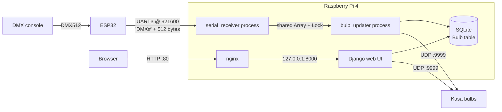

# dmx_smartbulb

Control TP-Link Kasa smart bulbs from a DMX lighting console.

A Raspberry Pi 4 receives a DMX universe over serial from an ESP32, maps groups of
three DMX channels to hue / saturation / brightness for each configured bulb, and
sends the colors to the bulbs over the local network using the Kasa UDP protocol.
A small Django web UI is used to add bulbs, assign DMX channels, and test colors.

## How it works



When Django starts, [config/apps.py](config/apps.py) calls
`start_background_processes()` in [config/jobs.py](config/jobs.py). That function
starts two daemon processes, which share a 512-byte `multiprocessing.Array`, a `Lock`,
and a `data_valid` flag:

- **`serial_receiver`** reads frames from `/dev/ttyAMA3`, re-aligns on the `DMX#`
  header if it gets out of sync, and copies the 512 data bytes into the shared array.
- **`bulb_updater`** wakes every 100 ms and, once valid data has arrived, does the
  following for every enabled bulb:
  1. Reads three consecutive channels starting at the bulb's configured channel.
  2. Sends a color update if the value changed. Every ~2 s it resends all bulbs,
     even unchanged ones, in case a packet was lost.
  3. Waits 5 ms between bulbs.

The receiver and updater run as separate processes so that slow network sends
can't starve the serial reader.

### Serial frame format (ESP32 → Pi)

| Bytes | Content |
|-------|---------|
| 0–3   | ASCII `DMX#` header |
| 4–515 | 512 DMX channel values; byte 4 is DMX channel 1 (the start code isn't sent) |

Settings are 921600 baud, 8N1, received on the Pi's UART3.

### Channel mapping

A bulb configured with channel **N** uses three DMX channels:

| DMX channel | Meaning    | Scaling sent to bulb |
|-------------|------------|----------------------|
| N           | Hue        | 0–255 → 0–360°       |
| N + 1       | Saturation | 0–255 → 0–100 %      |
| N + 2       | Brightness | 0–255 → 0–100 %; 0–2 turn the bulb off |

When saturation is 0, hue is forced to 180. Color changes use a 30 ms transition.

### Kasa protocol

[config/kasabulb/kasabulb.py](config/kasabulb/kasabulb.py) talks to the bulbs directly.
It sends JSON commands obfuscated with Kasa's XOR "autokey" cipher (initial key 171)
as UDP packets to port 9999. Color updates are fire-and-forget; only state queries
wait (500 ms) for a reply. Discovery broadcasts `get_sysinfo` to `255.255.255.255`
and collects `IOT.SMARTBULB` responses until none arrive for 2 s.

## ESP32 DMX receiver

Firmware source: [dmx_esp32/](dmx_esp32/) (PlatformIO, Arduino framework, `esp32dev` board,
using the [esp_dmx](https://github.com/someweisguy/esp_dmx) library).

- `loop()` receives DMX512 on UART2 through an RS-485 transceiver and copies each
  good packet into a buffer guarded by a mutex.
- A `SerialTx` task pinned to core 0 sends that buffer to the Pi every 20 ms (~50 Hz)
  as `DMX#` plus the 512 channel bytes. The DMX start code is not sent.
- If DMX is lost, the ESP32 keeps sending the last good frame, so bulbs hold their color.

Wiring is covered under [Hardware](#hardware). Debug output goes to the ESP32's USB
serial port at 115200 baud.

Build and flash from `dmx_esp32/` with `pio run -t upload`, or use the
PlatformIO VS Code extension.

## Hardware

### Parts

| Part | Notes |
|------|-------|
| Raspberry Pi 4 Model B, 1 GB | Stick-on heatsinks; wired Ethernet; powered from its USB-C port |
| ESP32 DOIT DevKit V1 (30-pin, ESP32-WROOM-32) | Matches the `esp32dev` PlatformIO board. Currently sits loose in the enclosure with electrical tape over its pins |
| CQRobot DMX (RDM) Shield for Arduino ([Amazon B01DUHZAT0](https://www.amazon.com/dp/B01DUHZAT0)) | Silkscreen `CTC-DRA-10-R2`. MAX485 RS-485 transceiver plus two 3-pin XLR jacks (DMX in/thru). Used standalone, without an Arduino |
| 3 A 40 V Schottky diode | Feeds the ESP32's VIN from the Pi's 5 V rail; appears to be a 1N5822 (heat-shrunk inline on the wire) |
| 3D-printed vented enclosure | |
| TP-Link Kasa **KL135** smart bulbs | The only model tested; see [Supported bulbs](#supported-bulbs) |
| Jumper wires | Dupont connectors on the Pi header and the shield |

### Photos


### DMX shield jumpers

| Jumper | Setting | Effect |
|--------|---------|--------|
| EN / EN̅ | **EN** | Shield enabled |
| Slave / DE | **Slave** | Transceiver held in receive mode; the DE pin is not used |
| TX-io / TX-uart | **TX-uart** | Transmit data on header pin 1 (TX1); not wired |
| RX-io / RX-uart | **RX-uart** | Received DMX data on header pin 0 (**RX0**) |

The silkscreen's "PIN MAPPING" box (RX-io = 3, TX-io = 4, DE = 2) only applies when
the jumpers are in the io/DE positions, which this build doesn't use.

### Wiring


| From | To | Purpose |
|------|----|---------|
| XLR **In** (male) | DMX console | DMX512 in |
| XLR **Thru** (female) | Next fixture (optional) | DMX pass-through |
| Shield **RX0** | ESP32 **GPIO16** (RX2) | DMX data |
| ESP32 **GPIO14** | Pi **pin 29** (GPIO5 / RXD3) | Framed DMX at 921600 baud |
| Pi **pin 2** (5 V) | ESP32 **VIN** through the 1N5822 (anode at the Pi) | ESP32 power |
| Pi **pin 9** (GND) | ESP32 **GND** (the one next to VIN) | ESP32 ground |
| Pi **pin 4** (5 V) | Shield **5V** | Shield power |
| Pi **pin 6** (GND) | Shield **GND** (the one next to 5V) | Shield ground |

The diode wire is red but covered in black heat-shrink. ESP32 GPIO17 (TX2) and GPIO21
(RTS) are set up by the firmware but not connected, because the Slave jumper
hard-wires the shield to receive.

### Power

The Pi is powered from its USB-C port, and everything else runs off the Pi's 5 V
header pins:

- **Shield:** 5 V directly.
- **ESP32:** VIN through the Schottky diode, which drops about 0.3–0.5 V. The ESP32's
  onboard regulator makes 3.3 V from that. The diode stops the ESP32's USB port from
  back-feeding the Pi's 5 V rail when it's plugged into a computer for flashing or
  debugging, so the ESP32 can be reflashed in place.

> **Logic levels:** the Pi and ESP32 both use 3.3 V, so the ESP32 → Pi link needs no
> level shifting. The shield's MAX485 runs from 5 V, so its receiver output on RX0
> drives ESP32 GPIO16 at close to 5 V, which is above the ESP32's rated 3.6 V input.
> It works today, but a resistor divider (e.g. 1 kΩ in series, 2 kΩ to GND) or a level
> shifter on that line would be safer.

### Network

```
Pi 4 ──Ethernet──▶ WiFi router LAN port
                   WiFi router ◀──WiFi── Kasa bulbs
```

The Pi's WiFi is disabled (`disable-wifi`), so it's wired into a LAN port on the WiFi
router, and the bulbs join that router's WiFi network. The router has to bridge its
LAN ports and WiFi into one subnet (the default on home routers), because:

- **Discovery** broadcasts to `255.255.255.255`, which only reaches devices in the
  same broadcast domain.
- **Color commands** go directly to each bulb's IP.

Don't put the bulbs on a guest network, and turn off "AP/client isolation" on the
bulbs' network. Either one blocks the Pi from reaching them.

**Give every bulb, and the Pi, a DHCP reservation on the router.** Bulbs are stored
by IP address only. If the router hands a bulb a new address, it silently stops
responding to DMX until its IP is fixed in the web UI.

## Raspberry Pi setup from scratch

1. **Flash the OS.** Use Raspberry Pi Imager to write **Raspberry Pi OS Lite (64-bit)**,
   Debian 12 "bookworm". In the Imager settings, set the hostname, create user
   `phola` (the service script assumes this name), and enable SSH.

2. **Network.** Connect Ethernet to a LAN port on the router whose WiFi the bulbs use;
   WiFi gets disabled in step 4. Reserve IPs for the Pi and bulbs; see [Network](#network).

3. **Install packages.**

   ```bash
   sudo apt update && sudo apt full-upgrade -y
   sudo apt install -y git nginx runit python3-venv
   ```

4. **Enable UART3.** Add these lines to `/boot/firmware/config.txt`, then reboot:

   ```ini
   enable_uart=1
   dtoverlay=uart3
   dtparam=uart3=on
   dtoverlay=disable-bt
   dtoverlay=disable-wifi
   ```

   After rebooting, `ls /dev/ttyAMA3` should show the port.

5. **Install the app.**

   ```bash
   sudo mkdir /dmx_smartbulb && sudo chown phola: /dmx_smartbulb
   git clone https://github.com/yesterdayforgotten/dmx_smartbulb.git /dmx_smartbulb
   cd /dmx_smartbulb
   python3 -m venv env
   env/bin/pip install -r requirements.txt psutil
   env/bin/python manage.py migrate
   env/bin/python manage.py createsuperuser   # optional, for /admin/
   ```

   `psutil` is imported by `config/apps.py` but is not yet listed in `requirements.txt`.

6. **Create the log directory.** gunicorn won't create it, and the service fails to
   start without it.

   ```bash
   sudo mkdir -p /var/log/gunicorn && sudo chown phola: /var/log/gunicorn
   ```

7. **Configure nginx.** nginx serves `/static/` directly and proxies everything else
   to gunicorn on `127.0.0.1:8000`. Remove the stock default site, because both
   configs claim `default_server` and `nginx -t` would fail:

   ```bash
   sudo rm /etc/nginx/sites-enabled/default
   sudo cp dmx_smartbulb.nginx /etc/nginx/sites-available/dmx_smartbulb
   sudo ln -s /etc/nginx/sites-available/dmx_smartbulb /etc/nginx/sites-enabled/
   sudo nginx -t && sudo systemctl reload nginx
   ```

8. **Create the runit service.** Run `sudo mkdir -p /etc/sv/dmx_smartbulb`, then put
   this in `/etc/sv/dmx_smartbulb/run` (it isn't in the repo yet):

   ```sh
   #!/bin/sh

   ROOT=/dmx_smartbulb
   GUNICORN=$ROOT/env/bin/gunicorn
   PID=/var/run/gunicorn/prod.pid

   mkdir /var/run/gunicorn
   chown phola /var/run/gunicorn

   if [ -f $PID ]; then rm $PID; fi

   cd $ROOT
   exec $GUNICORN -c $ROOT/dmx_smartbulb/gunicorn/prod.py --pid=$PID dmx_smartbulb.wsgi:application --timeout 5
   ```

   Then enable it. runit starts the service within a few seconds and at every boot.

   ```bash
   sudo chmod +x /etc/sv/dmx_smartbulb/run
   sudo ln -s /etc/sv/dmx_smartbulb /etc/service/dmx_smartbulb
   ```

9. **Verify.**
   - `sudo sv status dmx_smartbulb` shows `run`.
   - `/var/log/gunicorn/error.log` contains `bulb_updater: Starting`.
   - `http://<pi-address>/` loads.
   - Use `/?discovery` to find bulbs, assign channels, enable them, and save.

> **Keep `workers = 1`.** Each gunicorn worker runs `ConfigConfig.ready()` and would
> start its own receiver/updater pair, causing several processes to fight over the serial port.

### System tuning

These changes to the base OS are optional, but they're in place on the current Pi.

- **CPU governor `performance`.** Keeps the cores at 1.8 GHz instead of scaling down, so the
  serial receiver never waits for the clock to ramp up. Raspberry Pi OS's
  `raspi-config` boot service reads this file:

  ```bash
  echo 'CPU_DEFAULT_GOVERNOR=performance' | sudo tee /etc/default/cpu_governor
  sudo systemctl restart raspi-config     # apply now; also runs at every boot
  cat /sys/devices/system/cpu/cpu*/cpufreq/scaling_governor   # performance ×4
  ```

- **zram swap.** Compressed swap in RAM, used before the 200 MB swap file on the SD card.

  ```bash
  sudo apt install -y zram-tools
  echo 'PERCENT=50' | sudo tee -a /etc/default/zramswap
  sudo systemctl restart zramswap
  ```

- **earlyoom.** Kills a runaway process before the 1 GB Pi locks up. It prefers to kill
  dev tools (VS Code server, Claude Code) and avoids the app and SSH:

  Install it with `sudo apt install -y earlyoom`, set this line in
  `/etc/default/earlyoom`, then run `sudo systemctl restart earlyoom`:

  ```sh
  EARLYOOM_ARGS="-m 5 -s 10 --prefer '(claude|node)' --avoid '(gunicorn|python3|sshd)'"
  ```

- **WiFi power saving off.** `/etc/rc.local` runs `/sbin/iwconfig wlan0 power off`.
  It has no effect while `disable-wifi` is set, but it's needed if WiFi is ever re-enabled.

If you develop on the Pi with VS Code Remote-SSH, keep the remote server light. Add these
to `~/.vscode-server/data/Machine/settings.json`: `"python.languageServer": "Jedi"`,
`"python.analysis.indexing": false`, and `**/env` in `files.watcherExclude` and
`search.exclude`. Also disable heavy extensions (Pylance, C/C++, PlatformIO) on the
SSH host.

### Updating

```bash
cd /dmx_smartbulb && git pull
env/bin/pip install -r requirements.txt psutil
env/bin/python manage.py migrate
sudo sv restart dmx_smartbulb
```

### Logs

`capture_output = True` sends all `print()` output from the app and background
processes into the gunicorn logs:

- `/var/log/gunicorn/error.log`: app output, background processes, errors
- `/var/log/gunicorn/access.log`: HTTP requests
- `/var/log/nginx/dmx_smartbulb.*.log`: nginx

## Using the web UI

Browse to `http://<pi-address>/`.

- **Home page**: a list of bulbs (name, IP, DMX channel, enabled). Edit and save
  them, or add and delete rows.
- **Discovery**: `/?discovery` broadcasts for Kasa bulbs on the LAN and adds any
  new ones as unsaved rows, prefilled with their name and IP.
- **Admin**: `/admin/` (Django admin).

Only bulbs marked **enabled** are driven by DMX. Valid channels are 1–510 (see
[Known issues](#known-issues)).

Bulbs must already be on the WiFi network, set up with the Kasa app, before discovery
can find them.

### AJAX endpoints

These require the `X-Requested-With: XMLHttpRequest` header; without it they return 400.

| URL | Action |
|-----|--------|
| `query/<id>/` | Read the bulb's current state. Returns `{h,s,v}` or `{t,v}` |
| `set/<id>/h<H>s<S>v<V>/` | Set color (H 0–359, S/V 0–100) |
| `set/<id>/t<T>v<V>/` | Set color temperature (Kelvin) and brightness |
| `set_default/<id>/t<T>v<V>/` | Set the bulb's power-on default state |

## Patching on the lighting console

Each bulb is a 3-channel fixture. Patch it at the bulb's channel **N** as:

| Offset | Address | Parameter | Range |
|--------|---------|-----------|-------|
| +0 | N | Hue | 0–255 → 0–360°; 0 and 255 are both red |
| +1 | N + 1 | Saturation | 0 = white, 255 = full color |
| +2 | N + 2 | Brightness | 0–2 = off, 255 = full |

Space bulbs at least 3 channels apart (1, 4, 7, …). Avoid giving two bulbs the same
channel (see [Known issues](#known-issues)). Most consoles have no HSV fixture type,
so either build a 3-channel custom fixture profile with these parameters or patch
three generic dimmer channels per bulb. Color temperature (white) mode isn't available from DMX; use the
web UI for it.

### Performance expectations

Smart bulbs aren't stage fixtures, so plan looks around these limits:

- **Update rate:** the Pi checks for DMX changes every **100 ms**, so a bulb gets at
  most about 10 updates per second. Each changed bulb adds about 5 ms more, so large
  rigs update more slowly.
- **Fades:** each update tells the bulb to fade over 30 ms. Slow fades look smooth;
  fast chases and strobes look steppy or get missed.
- **Refresh:** every ~2 s all enabled bulbs are re-sent their current color, even if
  unchanged. A bulb that missed a UDP packet catches up within about 2 s.
- **Startup:** bulbs aren't touched until the first DMX frame arrives from the ESP32.
- **DMX loss:** the ESP32 keeps sending the last frame, so bulbs hold their last color.

## Backup and restore

The bulb list (names, IPs, channels, enabled flags) is stored only in `db.sqlite3`,
which isn't in git. Back it up after making changes:

```bash
cd /dmx_smartbulb
env/bin/python manage.py dumpdata config.Bulb --indent 2 > bulbs.json
```

Copy `bulbs.json` off the Pi, for example with `scp`. To restore it on a fresh
install, after `migrate`:

```bash
env/bin/python manage.py loaddata bulbs.json
sudo sv restart dmx_smartbulb
```

## Troubleshooting

Check the logs first: `tail -f /var/log/gunicorn/error.log`.

| Symptom | Likely cause / fix |
|---------|--------------------|
| `Couldn't find DMX# header, trying again` repeats | Bytes are arriving but aren't valid frames: wrong firmware on the ESP32, a baud rate mismatch, or electrical noise on the data wire |
| Frequent `tweaking, start_offset` messages | Frames are getting out of alignment: a noisy or loose data wire, or two copies of the app reading the port at once (the service plus the VS Code debug server) |
| Bulbs never change and there are no serial messages in the log | Either nothing is arriving on the serial port, or the receiver crashed. The receiver waits silently when no data arrives, so a dead ESP32 logs nothing. Check the ESP32 is powered, its USB serial output (115200 baud) shows `DMX is connected!`, and the GPIO14 → Pi pin 29 wire is seated. If there's a `serial_receiver` traceback instead (e.g. `/dev/ttyAMA3` missing because the `config.txt` overlay isn't applied), fix the cause and run `sudo sv restart dmx_smartbulb`; it doesn't restart on its own |
| One bulb doesn't respond | It isn't marked enabled, its IP changed (add a [DHCP reservation](#network)), or it's on a different network. Check it in the Kasa app |
| No bulbs respond, but the ESP32 reports `DMX is connected!` | The console isn't sending on the bulbs' channels; confirm the patch and that the cable is in the **male** (In) XLR jack |
| Discovery finds nothing | The bulbs are on a guest network or behind client isolation, or aren't set up yet; see [Network](#network) |
| Color picker / bulb query shows an error | The bulb is offline. The query endpoint returns HTTP 500 instead of a clear message ([known issue](#known-issues)) |
| Web UI doesn't load | `sudo sv status dmx_smartbulb` and `sudo systemctl status nginx`; check `/var/log/nginx/dmx_smartbulb.error.log` |
| Pi becomes unresponsive while developing on it | Out of memory; see [System tuning](#system-tuning) |

## Supported bulbs

Only the **TP-Link Kasa KL135** has been tested. The app uses the Kasa *legacy* local
protocol (XOR-obfuscated JSON on UDP port 9999). Other Kasa color bulbs that speak this
protocol (e.g. KL125, KL130) will likely work. Bulbs on newer firmware that only
accept the encrypted KLAP protocol, and Tapo bulbs, won't work.

## Known issues

- **A bulb on channel 511 crashes the bulb updater.** It reads channels N to N + 2,
  and N + 2 = 513 is past the end of the 512-channel universe. The form allows 511, so
  use **1–510** until this is fixed. The crash stops updates for all bulbs until the
  service restarts.
- **Querying an offline bulb returns HTTP 500** instead of a clear error.
- **Bulbs sharing a channel lag.** Change detection is tracked per channel, not per bulb,
  so only the first bulb on a shared channel updates immediately. The others only catch
  up at the ~2 s refresh.
- **The background processes aren't supervised.** If the serial receiver or bulb
  updater crashes, it stays down until the service restarts.

## Future enhancements

- **Bulb pairing from the web UI.** Today, new bulbs must be put on the WiFi network
  with the Kasa app before discovery can find them. The plan is to do that from this
  app instead: connect to a factory-reset bulb's setup access point and send it the
  WiFi credentials over the local protocol, so no Kasa app or account is needed.

## Development

- **Dev server**: `env/bin/python manage.py runserver 0.0.0.0:1234`, or the same
  command from a VS Code debug configuration (`.vscode/` isn't tracked). Stop the runit service first (`sudo sv stop dmx_smartbulb`). Otherwise both copies
  read `/dev/ttyAMA3` and each gets only part of the data.
- **gunicorn dev config**: `env/bin/gunicorn -c dmx_smartbulb/gunicorn/dev.py`
  (auto-reload, debug logging to `/var/log/gunicorn/dev.log`).

## Project layout

```
config/                 Django app: Bulb model, views, forms, templates
  jobs.py               Background serial receiver + bulb updater
  kasabulb/kasabulb.py  Kasa UDP protocol client
dmx_smartbulb/          Django project: settings, urls, wsgi
  gunicorn/             gunicorn prod/dev configs
lib/dmx_python_client/  Legacy direct-DMX-over-UART reader (no longer used; see below)
static/, templates/     Front-end assets (jQuery formset, Spectrum color picker)
dmx_smartbulb.nginx     nginx site config
dmx_esp32/              ESP32 firmware (PlatformIO): DMX512 in → framed serial out
images/                 Hardware photos used in this README
```

`lib/dmx_python_client` read raw DMX directly from the Pi's UART by detecting the
break. It was replaced by the ESP32 + framed serial approach; the old receiver
code is still commented out in `jobs.py`.

## License

[MIT](LICENSE). `lib/dmx_python_client` is third-party code under its own Apache 2.0
license ([lib/dmx_python_client/LICENSE](lib/dmx_python_client/LICENSE)).
